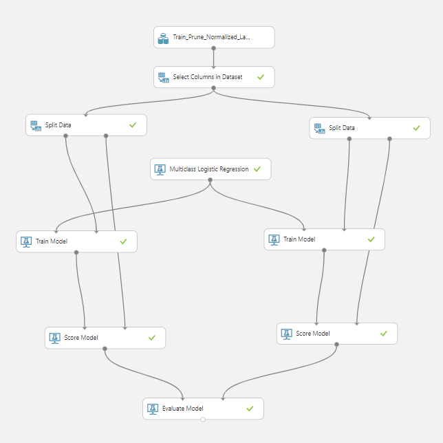

# Microsoft Professional Program in Artificial Intelligence: Final Capstone Project

The Microsoft Professional Program in Artificial Intelligence’s capstone project challenged to build an image classifier based on a 40k image dataset, 20k for training and test set each, of Progressive multifocal leukoencephalopathy (PML) brain disease. The classifier needed to identify orientation of the scanned images correctly. The requirement is that the classifier must be able to pass the accuracy tolerance, as log loss can't be greater than 0.30. 
The test taker can use any tools to achieve this challenge within a four weeks time frame.

## Summary
My plan of attack was first extracted pixel information from images, cleaned, normalized data and concatnated training set's label with Python, then used Microsoft Azure Machine Learning Studio (classic) (which now revamped and joined its full service to Microsoft Azure) to filter out the low-non influence features (pixel) and created Multi Logistic Regression (MLR) to tackle the problem. Finally, I finished the project with a log loss of .255 and passed this challenge.

## Detail of the attack

1. First I prepared data and vectorized images’s pixels to dataframe, then saved to csv. The code appeared in [MPPAI_Data_Process.py](https://github.com/singhanart/Microsoft_Professional_Program_in_AI_Capstone/blob/master/MPPAI_Data_Process.py/).
taking care of the whole of these processes.

2. Next, I worked in Azure ML Studio (classic), I applied the "Permutation Feature Importance" module to identify irrelevant features, in this case pixels. After processing the module, I'm able to ignore the low-non influence pixel for 1926 pixel from the total of 4096 pixel (64 x 64 px) which also reduced the train and test set csv file size by almost half.

3. After got the final csv file from step 2, I set up the model for training and prediction(in the picture below. For this challenge I selected Multiclass Logistic Regression to solve the problem.

Model's evaluation and confusion matrix 

